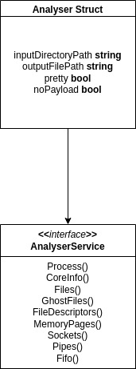
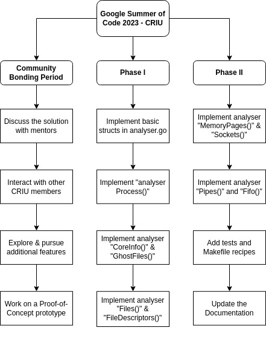

<style scoped>
table {
  font-size: 8px;
}
</style>

<style scoped>
img
{
  display: block;
  float: none;
  margin-left:auto;
  margin-right:auto;
}
</style>


# Forensic Analysis of Container Checkpoints

**Mentors**: [Radostin Stoyanov](mailto:rstoyanov@fedoraproject.org), [Adrian Reber](mailto:areber@redhat.com)

## Table of Contents

1. **[Abstract](#1-abstract)**
2. **[Technical Details](#2-technical-details)**
	2.1. [Forensic Container Checkpointing](#21-forensic-container-checkpointing)
	2.2. [Analysing the `checkpoint/` Directory](#22-analysing-the-checkpoint-directory)
	&nbsp;&nbsp;&nbsp;&nbsp;2.2.1. *[Protobuf Image Files](#221-protobuf-image-files)*
	&nbsp;&nbsp;&nbsp;&nbsp;2.2.2. *[Memory Dump Files](#222-memory-dump-files)*
	&nbsp;&nbsp;&nbsp;&nbsp;2.2.3. *[Decoding Image Files using go-crit](#223-decoding-image-files-using-go-crit)*
3. **[Implementation](#3-implementation)**
	3.1. [Analyser CLI App](#31-analyser-cli-app)
4. **[Timeline](#4-timeline)**
	4.1. [Before May 4](#41-before-may-4)
	4.2. [May 4 - May 28 (Community Bonding Period)](#42-may-4---may-28-community-bonding-period)
	4.3. [May 29 - July 14 (Phase I)](#43-may-29---july-14-phase-i)
	4.4. [July 15 - Sep 4 (Phase II)](#44-july-14---sep-4-phase-ii)
	4.5. [After Sep 4](#45-after-sep-4)
5. **[Personal Information](#5-personal-information)**
	5.1. [About Me](#51-about-me)
	5.2. [Open Source Activity](#52-open-source-activity)
	5.3. [Commitments during GSoC 2023](#53-commitments-during-gsoc-2023)

<br style="line-height:40" />

## 1. Abstract

A container can be checkpointed by container engines like ***Podman*** and ***CRI-O***. A checkpoint archive contains all the data related to a checkpoint, largely as CRIU image files. CRIU provides a Go-based tool called `checkpointctl` to display high level information about these checkpoint archives. CRIU also provides a Go-based tool called `go-crit` in order to explore and manipulate checkpoint images both as an ***import-and-use*** dependency as well as a ***standalone CLI application***. 

However, users need to have a thorough understanding of the CRIU image formats to effectively utilise this new feature for analysis. This project aims to extend the [checkpointctl](https://github.com/checkpoint-restore/checkpointctl) tool with functionality for forensic analysis of container checkpoints utilising [go-crit](https://github.com/checkpoint-restore/go-criu/tree/master/crit) and significantly enhancing user experience. 

This solution is expected to provide a ***tool*** or a ***set of functionalities*** along with a CLI-implementation as an extension to the current ***checkpointctl*** tool. This should allow users to perform forensic analysis without having to deeply understand CRIU images.

<br style="line-height:60" />

## 2. Technical Details

### 2.1. Forensic Container Checkpointing

Forensic container checkpointing allows the creation of stateful copies of a running container without the container knowing that it is being checkpointed. The copy of the container is then analysed without the original container being aware of it. At the time of writing this proposal, only ***CRI-O: v1.25*** has support for forensic container checkpointing, which must only be used as a container runtime for a Kubernetes installation. 

In Kubernetes, the container checkpoint is available as a compressed archive in the form of a  `.tar` file. In the following parts of the proposal, I will be referring to the checkpoint archive as `ContainerCheckpoint.tar`. 

Some initial information about the checkpointed container as well as some statistics about the checkpointing process itself can be displayed using `checkpointctl show ContainerCheckpoint.tar --print-stats`. This command gives the following output for a ***MongoDB*** container.

| CONTAINER | IMAGE               | ID           | RUNTIME | CREATED             | ENGINE | IP          | CHKPT SIZE | ROOT FS DIFF SIZE |
|-----------|---------------------|--------------|---------|---------------------|--------|-------------|------------|-------------------|
| mongo     | mongo:4.2.16-bionic | dbfa8d819af4 | runc    | 2023-03-10T08:01:32 | CRI-O  | 10.04.08.22 | 7.9 MiB    | 0.8 KiB           |

***CRIU dump statistics***

| FREEZING TIME | FROZEN TIME | MEMDUMP TIME | MEMWRITE TIME | PAGES SCANNED | PAGES WRITTEN |
|---------------|-------------|--------------|---------------|---------------|---------------|
| 98881 us      | 101265 us   | 9773 us      | 5901 us       | 4012          | 1262          | 

The checkpoint archive is extracted with the help of `tar xf ContainerCheckpoint.tar`. Extracting the checkpoint archive results in the following files and directories:

| Files / Directories    | Description                                                                                  |
|------------------------|----------------------------------------------------------------------------------------------|
| `bind.mounts`          | contains information about bind mounts to mount all external files (required during restore) |
| `checkpoint/`          | contains CRIU image files as created by CRIU (the actual checkpoint)                         |
| `*.dump`               | contain metadata about the container (required during restore)                               |
| `dump.log`             | contains debug output of CRIU during the process of checkpointing                            |
| `stats-dump`           | contains data to dump display statistics                                                     |
| `rootfs-diff.tar`      | contains all the files that changed on the container's filesystem                            |

Of the above mentioned files and directories, the `rootfs-diff.tar` file and the `checkpoint/` directory are important for analysis of the checkpointed container; the former is for tracking the ***file system changes*** and the latter is for ***analysing the checkpointed processes***.  This solution proposed is focused on providing a tool to help with the latter.

### 2.2. Analysing the `checkpoint/` Directory

The data created by CRIU while checkpointing processes in the container is stored in the `checkpoint/` directory. Thus, the content in this directory consists of CRIU images, which can be analysed with the help of [go-crit](https://github.com/checkpoint-restore/go-criu/tree/master/crit). Currently, CRIU images are of three types:

- CRIU-specific files stored in the protobuf format
- Memory dump files
- Raw image files

Of the above mentioned files, the ***protobuf image files*** and the ***memory dump files*** are important for analysing the checkpointed container.

#### 2.2.1. Protobuf Image Files

These files follow a standard defined format for storing data. Every file begins with ***two 4-byte entries***, also called as ***magic cookies***. The first entry contains the ***type of the image***. The second entry is optional, and contains the ***sub-type of the image***. This is followed by ***zero or more pairs*** of values - a 4-byte entry containing the ***size of the payload***, followed by ***the payload*** itself. Optionally, each of these pairs may be followed by ***extra payload***, depending on the entry type. The binary image data is organised as follows:

| Data                                | Size (bytes)                   |
|-------------------------------------|--------------------------------|
| Magic                               | 4                              |
| Magic<sub>2</sub> (optional)        | 4                              |
| Size<sub>0</sub>                    | 4                              |
| Payload<sub>0</sub>                 | Size<sub>0</sub>               |
| ExtraPayload<sub>0</sub> (optional) | Depends on Payload<sub>0</sub> |
| ...                                 | ...                            |
| Size<sub>N</sub>                    | 4                              |
| Payload<sub>N</sub>                 | Size<sub>N</sub>               |

There exists a large number of protobuf image files, each containing specific information about the checkpointed container. 

#### 2.2.2. Memory Dump Files

These files are of two types - ***pagemap***, and ***pages***. The pagemap file contains a list of pairs - the ***memory location*** of the data, followed by the ***number of pages***. The pages file contains a set of 4-kilobyte entries, each of which is a full page.

#### 2.2.3. Decoding Image Files using go-crit

The [go-crit](https://github.com/checkpoint-restore/go-criu/tree/master/crit) helps decode the above mentioned images from Binary to JSON format and store them in go-structs for analysis as shown below:

```go
// image.go
// CriuImage represents a CRIU binary image file
type CriuImage struct {
	Magic   string       `json:"magic"`
	Entries []*CriuEntry `json:"entries"`
}

// CriuEntry represents a single entry in an image
type CriuEntry struct {
	proto.Message
	Extra string
}

```
<br style="line-height:6" />

## 3. Implementation

A new tool named ***cc-analyser*** (Container Checkpoint Analyser) will be created as a new library in the [checkpointctl](https://github.com/checkpoint-restore/checkpointctl) repository. This basic library will consist of standalone files for each of the analysis operations intended to be provided. By leveraging the concept of interfaces in Go, a ***common worker agent*** will be able to call all operation functions. This interface can simply be extended in the future to add new functionalities to ***cc-analyser***.



All interface functions will be ***exportable*** so that they can be called through imports. The structure of the code is as follows:

```go
// analyser.go
type Analyser struct {
	inputDirectoryPath string
	outputFilePath string
	pretty bool
	noPayload bool
}

type AnalyserService interface {
	Processes()	// Show all running processes with respective PID, PPID, PGID, SID, etc.
	CoreInfo()	// Show core process info  
	Files()	// Show all open files unless specified
	GhostFiles()	// Show all invisible files unless specified
	FileDescriptors()	// Show all open file descriptors unless specified
	MemoryPages()	// Show memory mapping of all processes unless specified
	Sockets()	// Show all sockets unless specified
	Pipes()	// Show all pipes unless specified
	Fifo()		// Show all named pipes unless specified
}

func New(
	inputDirectoryPath, outputFilePath,
	pretty, noPayload bool
) *AnalyserService {
	return &Analyser{
		inputDirectoryPath: inputDirectoryPath,
		outputFilePath: outputFilePath,
		pretty: pretty,
		noPayload: noPayload,
	}
}
```

### 3.1. Analyser CLI App

A `cli.go` file will provide a ***standalone binary*** that uses this worker agent to run the Analyser commands as a CLI application, built using [cobra](https://github.com/spf13/cobra). Every command will create an `AnalyserService` instance with the necessary struct variables and call the respective function through this service.

Alternatively, the CLI-implementation for the ***cc-analyser*** can be integrated with the existing CLI-implementation of `checkpointctl` tool (in the file `checkpointctl.go`), which also uses [cobra](https://github.com/spf13/cobra).  

<br style="line-height:60" />

## 4. Timeline



### 4.1. Before May 4

- Understand the Go implementation of ***crit*** and ***checkpointctl*** in detail as well as any other relevant code necessary to implement the solution.
- Go through relevant articles on forensic analysis.
- Work on a Proof-of-Concept prototype of the basic components to be implemented.

### 4.2. May 4 - May 28 (Community Bonding Period)

- Discuss the finer details of the implementation with my mentors and other community members.
- Investigate and pursue any other potential features that the CRIU community would suggest and accordingly accommodate them into the timeline.

### 4.3. May 29 - July 14 (Phase I)

- **May 29 - June 4**: Implement the basic structs and functions in `analyser.go`. They are the building blocks that will be reused across all command functions.
- **June 5 - June 11**: Implement the `analyser Process()` function and ensure it works and lists all running processes. Create the `analyser` CLI app and provide `process` as a command. Add necessary unit tests.
- **June 12 - June 18**: Implement the `analyser CoreInfo()` function and add `coreinfo` as a command in the CLI app. Add necessary unit tests.
- **June 19 - June 25**: Implement the `analyser GhostFiles()` function and add `ghostfiles` as a command in the CLI app. Add necessary unit tests.  
- **June 26 - July 2**: Implement the `analyser Files()` function and add `files` as a command in the CLI app. Add necessary unit tests.
- **July 3 - July 9**: Implement the `analyser FileDescriptors()` function and add `filedesc` as a command in the CLI app. Add necessary unit tests.
- **July 10 - July 14 (Phase I evaluation)**: Discuss progress with my mentors and any potential change of plan going forward.

### 4.4. July 14 - Sep 4 (Phase II)

- **July 14 - July 20**: Implement the `analyser MemoryPages()` function and add `mempages` as a command in the CLI app. Add necessary unit tests.
- **July 21 - July 27**: Implement the `analyser Sockets()` function and add `sockets` as a command in the CLI app. Add necessary unit tests.
- **July 28 - Aug 3**: Implement the `analyser Pipes()` function and add `pipes` as a command in the CLI app. Add necessary unit tests.
- **Aug 4 - Aug 10**: Implement the `analyser Fifo()` function and add `fifo` as a command in the CLI app. Add necessary unit tests.
- **Aug 11 - Aug 17**: Add necessary changes to the Makefile, test suite, and build ecosystem of ***checkpointctl*** in order to completely integrate the new code into the library. 
- **Aug 18 - Aug 24**: Add documentation and examples to the project README and the CRIU [website](https://criu.org).
- **Aug 25 - Aug 27**: This period serves as a buffer in order to accommodate unexpected delays or emergencies.
- **Aug 28 - Sep 4 (Phase II evaluation)**: Discuss progress with my mentors and any potential extensions, and what would be achieved during the extended period.

### 4.5. After Sep 4

- Discuss the outcome of the project with my mentors and the plan of action for future contribution.
- If provided with an extended timeline, discuss in fine detail what the course of action would be during this period.
- Engage with community members to get feedback on project implementation and discuss add-on features.

## 5. Personal Information

**Name**: Sankalp Acharya
**Email**: [sankalpacharya1211@gmail.com](mailto:sankalpacharya1211@gmail.com)
**GitHub**: [sankalp-12](https://github.com/sankalp-12)
**LinkedIn**: [Sankalp Acharya](https://www.linkedin.com/in/sankalpacharya/)
**Location**: Bengaluru, India
**Timezone**: GMT +0530

### 5.1. About Me

I am a third year undergraduate student pursuing my engineering in computer science from [Indian Institute of Technology, Bhilai](https://www.iitbhilai.ac.in/), Raipur, India. My areas of interest include distributed systems, cloud computing, and scalability. I am actively involved in cloud-native open-source projects such as [Meshery](https://layer5.io/).

My interest in applying to this project is due to my prior experience with Golang and containerization technologies such as Docker, K8s, etc. I'm deeply interested in learning low-level system design, reading through articles and attending conferences to attain a thorough understanding. I'm currently interning as a back-end developer at a leading startup in India, wherein I will primarily use Golang and its related tooling ecosystem. My experience with working on multiple Golang projects at scale makes me a suitable candidate for this project.

### 5.2. Open Source Activity

I have been submitting PRs and raising issues in the [criu](https://github.com/checkpoint-restore/criu) repository:

- PR: [Optimized shell code with <'s (instead of cat + |)](https://github.com/checkpoint-restore/criu/pull/2125)
- PR: [Distinguish criu crash from criu fail in ZDTM](https://github.com/checkpoint-restore/criu/pull/2140)
- Issue: [Cirrus CI / Vagrant Fedora based test fails](https://github.com/checkpoint-restore/criu/issues/2129)

### 5.3. Commitments during GSoC 2023

I will be dedicating 40 hours a week on average towards this project. My 7th semester classes will be happening during the program, but they will not affect my work in any manner.
